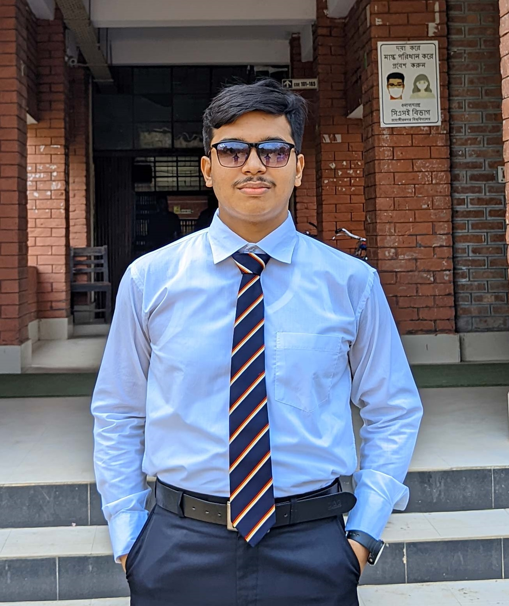

  
  

    <h1>Md. Mahebi Alom Dipu</h1>
    
<em>Web Developer & IoT Specialist</em>

    
Studing CSE in Jahangirnagar University

  

## Intro
 Hi! I am Mahebi Alom Dipu, a passionate Web Developer and IoT Specialist with a knack for creating innovative
 solutions that bridge the digital and physical worlds. With expertise in web development technologies like HTML,
 CSS, JavaScript, and backend frameworks, I craft user-friendly and efficient web applications. My proficiency in IoT
 and robotics allows me to design smart systems by integrating sensors, microcontrollers, and automation tools. Whether it's building responsive websites or developing intelligent IoT systems, I am driven by the goal of combining technology and creativity to solve real-world problems.

## Education

- **BSc. in Computer Science & Engineering**  
  *Jahangirnagar University*  
  March 2022-present

- **Higher Secondary School Certificate**  
  *Notre Dame College*      
  Group: Science   
  June 2017-April 2019  

- **Secondary School Certificate**  
  *Patuakhali Govt. Jubilee High School*      
   Group: Science      
  January 2015-February 2017
---

## Skills

- **Languages**: C, C++, HTML, CSS, JavaScript, Java, Database
- **Tools**: MS Office, Adobe Products, GitHub, VS Code, Arduino, EasyEda
- **Other**: Iot, Robotics

---

<!-- ## Professional Experience

- **[Current/Most Recent Company/Organization Name]**  
  *Front-End Developer*  
  [Employment Duration]  
  - Developed and maintained responsive websites and applications.
  - Collaborated with designers and back-end developers to create seamless user experiences.
  - Improved website performance and ensured cross-browser compatibility.
  - Implemented new features and optimized existing code. -->

---

## Projects

<!-- - **[Portfolio Website]**: Developed a personal portfolio website showcasing projects, skills, and experience. -->
- **JU Online Payment System**
- **Product Landing Page**
- **Tribute to Mashrafe Mortaza**
- **Home Automation Using ESP32**
- **Automated Roller Blind**
---

## Experience

- **Trainee at EDGE IoT & Robotics**        
*June 2024 – Present*

- **Working as a NCPC volunteer**       
*Mar 2024 – April 2024*

---
## Acheivement

- **National High School Programming Contest**:Reginal Winner & National level participant
- **i-gen Prothom Alo**: Regional Winner
- **FreeCodeCamp**: Certified for Responsive Web Design

## Hobbies
- **Electronics Experiments**
- **Tour**
- **Cooking**
---